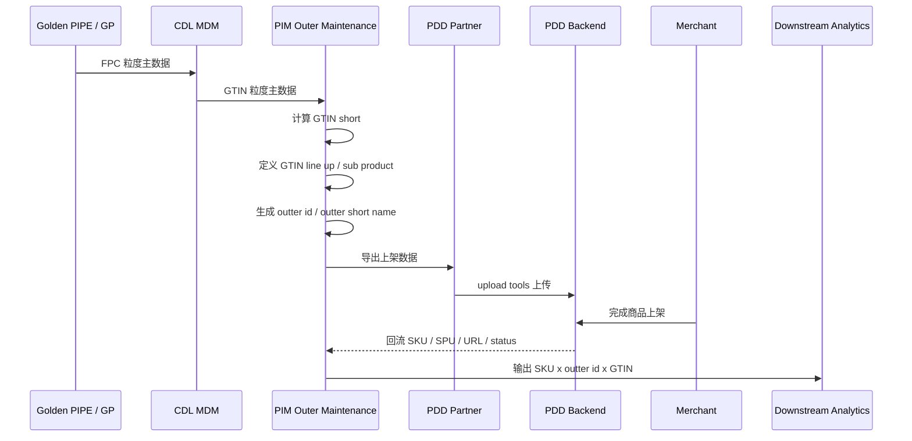

# PIM 模块架构草案

## 1. 模块定位

PIM 当前先聚焦 `Outer Maintenance` 模块。

这个模块的职责只有三件事：

1. 接收 CDL MDM 输出的 GTIN 粒度主数据。
2. 定义 GTIN 对应的 line up 和 sub product。
3. 根据 line up、sub product、GTIN 简称等规则生成 outter id 相关属性。

## 2. 交互图

## 3. 输入

输入来源：CDL MDM GTIN 粒度主数据。

当前已确认会参与规则计算的字段：

- `gtin_code`
- `category_cn`
- `product_name_cn`
- `demand_plan_level_3_name_en`
- `demand_plan_level_3_name_cn`
- `product_line_en`
- `variant_cn`
- `full_variant_cn`
- `sub_variant_name_cn`
- `cn_size_combined`

以下字段映射仍待确认：

- `Shave Sub Family` -> `TBD`

## 4. 核心输出

Outer Maintenance 当前输出以下核心对象：

- `outter_id`
- `outter_short_name`
- `outter_line_up`
- `outter_sub_product`
- `differentiation_tag`
- `gtin -> outter_id` 映射关系

## 5. 核心规则

### 5.1 GTIN Short

`GTIN_short` 基于 `Consumer Unit Barcode` 按公式取后六位。

具体公式细节：`TBD`

### 5.2 GTIN Line Up

GTIN line up 按 category 取不同字段：

- HC -> `DP Level3 En`
- PCC -> `Product Line En`
- OCNP -> `DP Level3 En`
- Shave -> `DP Level3 En`
- SC -> `Product Line En`
- FEM -> `Product Line En`
- BC -> `CN Variant`
- FHC -> `DP Level3 Cn`
- Power -> `DP Level3 Cn`

line up 结果需要支持去空格、格式归一和人工修正。

### 5.3 GTIN Sub Product

GTIN sub product 按 category 取不同字段：

- HC -> `CN Variant`
- PCC -> `DP Level3 En`
- OCNP -> `CN Variant`
- Shave -> `CN Variant`
- SC -> `DP Level3 En`
- FEM -> `DP Level3 Cn`
- BC -> `DP Level3 En`
- FHC -> `Product Line En`
- Power -> `Product Line En`

sub product 结果也需要支持格式归一和人工修正。

### 5.4 Outter 属性生成

`outter_id` 编码本身以 GP 最终规则为准。

如果一个 outter id 下有多个不同的 GTIN line up，则取 `GTIN Size` 最大的 line up 作为该 outter id 的 line up。

如果一个 outter id 下有多个不同的 GTIN sub product，则取 `GTIN Size` 最大的记录对应的 sub product 作为该 outter id 的 sub product。

`outter_short_name` 规则如下：

- 单品：`GTIN简称`
- 组品：`GTIN简称*支数 + GTIN简称*支数 + ...`

`differentiation_tag` 当前为人工维护。

## 6. 页面能力

Outer Maintenance 页面只保留以下关键能力：

1. 查看 GTIN 原始字段。
2. 查看系统计算出的 GTIN short、line up、sub product。
3. 查看系统生成的 outter id 相关属性。
4. 支持人工修正 line up、sub product、differentiation tag。
5. 保留操作日志。

## 7. 待确认

1. `GTIN_short` 的后六位公式是否有特殊处理。
2. `GTIN Size` 的比较口径是什么。
3. 单品和组品的判定规则是什么。
4. outter id 最终编码规则是否完全由 GP 定义。
5. `Shave Sub Family` 对应 CDL 的哪个正式字段。
